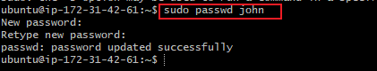

# Advanced_Linux_Commands
Advanced Linux commands include:

### 1. chomd:
It's short for "change mode", and it's used in Linux to change file or directory permissions.

The basic syntax is: chmod [options] permissions filename

There are two ways to set permissions:
 1. Symbolic mode: chmod u+r file.txt     # give read to user
chmod g+rw file.txt    # give read/write to group
chmod o-r file.txt     # remove read from others
chmod a+x script.sh    # give execute to all (user, group, others)

 1. Numeric mode: example, chmod 755 file.txt

    Where:

    7 = read + write + execute

    5 = read + execute

    0 = no permission

In the screenshot below, the chmod command was used to give execute permission to all users, groups, and others of the script.sh file.

### 2. adduser:
The adduser command in Linux is used to create a new user account.

The basic syntax is: sudo adduser username

In the screenshot below, I used the adduser command to create a new user named john. Running the command also prompted for the user's password, fullname and other information.

### 3. chown:
The chown command in Linux is used to change the ownership of a file or directory.

The basic syntax is: chown [owner][:group] filename

I used the chown command to give the user john, and all members of the developers group ownership of the file, filename.txt

### 4. Superuser:
A superuser is the most powerful user account on a Linux system — usually the root user. This account has unrestricted access to all files, commands, and system settings.

To switch to full superuser mode, you run the command: sudo -i

This is illustrated in the screenshot below:

To logout of the superuser mode, you run the exit command.

### 5. usermod:
The usermod command in Linux is used to modify an existing user account. It's commonly used to change a user's group, home directory, login name, and more.

The basic syntax is: sudo usermod [options] username

In the screenshot below, I used the usermod command to add the user john to the sudo group.

### 6. su:
The su command stands for "substitute user" or "switch user". It allows you to switch to another user account from your current session — most commonly used to switch to the root (superuser) account.

The basic syntax is: su - username

In the screenshot below, I used the su command to switch from the ubuntu to john, which prompted for john's password.

### 7. passwd:
The passwd command is used to set or change passwords for user accounts.

To change your own password, just type, passwd. To change another user's password, use the syntax: sudo passwd username.

In the screenshot below, I changed john's password.

### 8. addgroup:
The addgroup command is used to create a new group on a Linux system. The basic syntax is: sudo addgroup developers

In the above screenshot, I used the addgroup command to create the developers group.

### 9. id:
The id command displays the user ID (UID), group ID (GID), and group memberships of a specified user or the currently logged-in user.

To check your own ID info, you simply type id. To check ID info for another user, you use the syntax: id username

In the screenshot below, I used the command to check the ID info for john.

As can be seen, john belongs to four groups: john, users, sudo and developers

## Side Hustle Task 3

### 1. Creating the devops group:
Using the the addgroup command, I ceated the 'devops' group.

### 2. Creating the new users:

Using the adduser command, I created the following users: 'mary', 'mohammed', 'ravi', 'tunji', 'sofia'.

### 3. Ownwership of new folders:
I created new folder each in the home directory of the users.

Using the chown command, I ensured group ownership of each of the folders belong to 'devops'

As can be seen in the screenshot above, running the 'ls -ld' command confirmed that the group ownership of the /mary directory belongs to 'devops'.